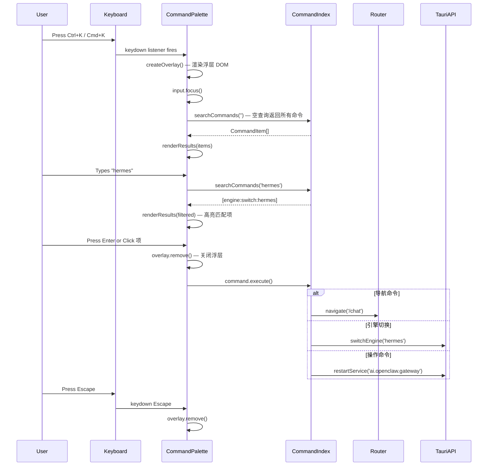
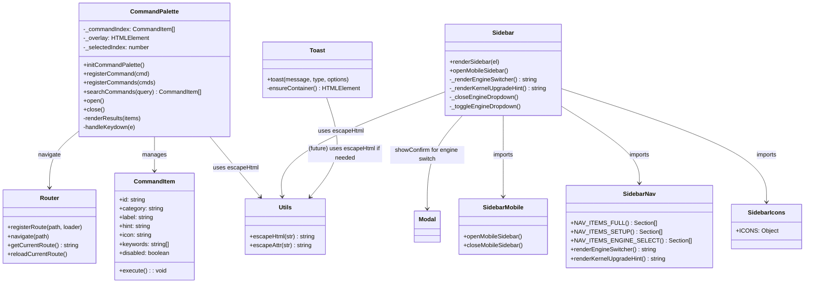

# ClawPanel 优化设计方案 — 架构师视角

> **作者**: Bob (Software Architect)  
> **日期**: 2025-06-04  
> **范围**: Command Palette / 代码结构优化 / Toast 可关闭 + 引擎切换确认

---

## 一、现有架构概览

ClawPanel 是一个 **Vanilla JS + Hash 路由 + CSS 变量主题系统** 的 Tauri 桌面应用。核心特征：

| 特征 | 描述 |
|------|------|
| **路由** | `router.js` — 极简 hash 路由，`registerRoute(path, loader)` + `navigate(path)` |
| **模块加载** | `main.js boot()` 中 `registerEngine()` 注册引擎，引擎提供 `getNavItems()`、`getSetupRoute()` 等 |
| **组件通信** | 无全局状态管理库，依赖 ES Module 单例导出 + 事件回调（如 `onEngineChange`、`onGatewayChange`） |
| **主题** | CSS 变量系统 (`variables.css`)，亮色/暗色双主题，`data-theme` 属性切换 |
| **国际化** | `lib/i18n.js` — `t(key, params)` 函数，多语言字典 |
| **模块导出** | ES Module 标准 — `export function` / `export default` |
| **命名约定** | 函数名 `camelCase`，CSS 类名 `kebab-case`，文件名 `kebab-case.js` |
| **文件结构** | `src/main.js` 入口 → `components/` UI 组件 → `pages/` 页面 → `lib/` 工具库 → `style/` 样式 → `engines/` 引擎 |

### 关键发现

1. **escapeHtml 重复 5+ 处**:
   - `main.js:50` → `escapeHtml(str)`
   - `dashboard.js:1146` → `escapeHtml(str)`
   - `hermes/pages/chat.js:27` → `escHtml(s)`
   - `router.js:154` → `escHtml(s)`
   - `chat-debug.js:482` → `esc(str)` (还包含 `&quot;` 转义)
   - `sidebar.js:420` → `_escSidebar(s)` (仅 `<` / `>`)
   - `modal.js:8` → `escapeAttr(str)` (额外转义 `"`)

2. **sidebar.js 518 行**，混合了：导航项定义 (19-102)、图标定义 (104-131)、引擎切换器 (136-176)、折叠逻辑 (178-192)、渲染逻辑 (194-418)、移动侧边栏 (462-483)、语言切换 (485-517)

3. **内联 CSS 注入**: `chat-debug.js` 的 `injectScanCSS()` 动态创建 `<style>` 标签约 50 行

4. **Toast 无关闭按钮**: 当前 toast 只靠 `setTimeout` 自动消失，无手动关闭

5. **引擎切换无确认**: sidebar.js 中 `.engine-option[data-engine]` 点击直接调 `switchEngine()`

---

## 二、方向 1: Command Palette (Ctrl+K)

### 2.1 实现方案

采用 **纯原生 JS** 实现，不引入外部模糊搜索库（如 Fuse.js），项目本身保持无框架风格。自行实现简易模糊匹配，对于面板级命令列表（通常 <100 条）性能完全够用。

### 2.2 新增文件

| 文件路径 | 职责 |
|----------|------|
| `src/components/command-palette.js` | Command Palette 核心组件：打开/关闭/搜索/执行 |
| `src/components/command-palette.css` | Command Palette 样式 |

### 2.3 修改文件

| 文件路径 | 变更 |
|----------|------|
| `src/main.js` | 导入 `initCommandPalette()`，在 `boot()` 中调用；导入 CSS |
| `src/lib/utils.js` | 提供 `escapeHtml()` |

### 2.4 搜索索引数据结构

```javascript
/**
 * Command Palette 搜索索引
 *
 * 每个 Command 项定义：
 * @typedef {Object} CommandItem
 * @property {string} id          - 唯一 ID，如 'nav:dashboard', 'engine:switch:hermes'
 * @property {string} category    - 分组标签: 'navigation' | 'engine' | 'action' | 'settings'
 * @property {string} label       - 显示名称（支持 i18n key 或直接文本）
 * @property {string} [hint]      - 副标题/说明
 * @property {string} [icon]      - SVG 或 emoji 图标
 * @property {string} [shortcut]  - 快捷键显示文本，如 'Ctrl+K'
 * @property {Function} execute   - 执行回调: () => void | Promise<void>
 * @property {string[]} [keywords]- 额外搜索关键词（中英文），提升匹配率
 * @property {boolean} [disabled] - 禁用状态
 */

// 索引注册表
const _commandIndex = []

/** 注册命令 */
export function registerCommand(cmd) { _commandIndex.push(cmd) }

/** 批量注册 */
export function registerCommands(cmds) { _commandIndex.push(...cmds) }

/** 搜索匹配（简易前缀 + 子串模糊） */
export function searchCommands(query) {
  const q = query.toLowerCase().trim()
  if (!q) return _commandIndex.filter(c => !c.disabled)
  return _commandIndex.filter(c => {
    if (c.disabled) return false
    const haystack = [c.label, c.hint || '', ...(c.keywords || [])].join(' ').toLowerCase()
    // 前缀匹配优先
    if (c.label.toLowerCase().startsWith(q)) return true
    // 子串匹配
    if (haystack.includes(q)) return true
    // 每个 query token 都命中
    const tokens = q.split(/\s+/)
    return tokens.every(t => haystack.includes(t))
  }).sort((a, b) => {
    // label 前缀匹配排最前
    const aPrefix = a.label.toLowerCase().startsWith(q) ? 0 : 1
    const bPrefix = b.label.toLowerCase().startsWith(q) ? 0 : 1
    return aPrefix - bPrefix
  })
}
```

### 2.5 Command 注册来源

在 `main.js` 的 `boot()` 中，引擎注册完成后批量注册命令：

```javascript
import { registerCommands } from './components/command-palette.js'

// 引擎注册后
registerCommands([
  // 导航命令（从 sidebar 导航项动态生成）
  ...getNavItemsAsCommands(),
  // 引擎切换
  ...getEngineCommands(),
  // 常用操作
  { id: 'action:restart-gateway', category: 'action', label: t('dashboard.restartGw'), icon: '🔄', execute: () => api.restartService('ai.openclaw.gateway') },
  { id: 'action:check-update', category: 'action', label: t('dashboard.checkUpdate'), icon: '🔍', execute: () => navigate('/about') },
  { id: 'action:toggle-theme', category: 'settings', label: t('sidebar.themeDark'), icon: '🌓', execute: () => toggleTheme() },
  // ...更多操作
])
```

### 2.6 UI 设计

居中弹出浮层，参考 Linear / VS Code 风格：

```
┌─────────────────────────────────────────┐
│ 🔍 搜索命令...                    Esc ✕  │  ← 搜索输入框
├─────────────────────────────────────────┤
│ 导航                                     │  ← category 分组标题
│   📊 仪表盘                   /dashboard │
│   💬 聊天                     /chat      │
│   ⚙️ 服务                     /services  │
│ ─────────────────────────────────────── │
│ 引擎                                     │
│   🐾 切换到 Hermes Agent          ⏎     │
│   🐾 切换到 Xintian               ⏎     │
│ ─────────────────────────────────────── │
│ 操作                                     │
│   🔄 重启 Gateway                         │
│   🔍 检查更新                             │
└─────────────────────────────────────────┘
```

### 2.7 时序图: Command Palette 打开 → 搜索 → 执行



### 2.8 CSS 方案 (command-palette.css)

使用 CSS 变量保持主题一致：

```css
/* 遮罩层 */
.command-palette-overlay {
  position: fixed; inset: 0; z-index: 10000;
  background: rgba(0,0,0,0.4); backdrop-filter: blur(4px);
  display: flex; justify-content: center; padding-top: 120px;
}

/* 主容器 */
.command-palette {
  width: 520px; max-height: 420px;
  background: var(--bg-card); border: 1px solid var(--border-primary);
  border-radius: var(--radius-lg); box-shadow: var(--shadow-lg);
  display: flex; flex-direction: column; overflow: hidden;
}

/* 输入框 */
.command-palette-input {
  width: 100%; padding: 14px 16px; border: none; outline: none;
  font-size: var(--font-size-md); background: transparent;
  color: var(--text-primary); border-bottom: 1px solid var(--border-secondary);
}

/* 结果列表 */
.command-palette-results { flex: 1; overflow-y: auto; padding: 8px; }
.command-palette-group-label { padding: 8px 12px 4px; font-size: 11px; color: var(--text-tertiary); font-weight: 600; text-transform: uppercase; }
.command-palette-item { display: flex; align-items: center; gap: 10px; padding: 8px 12px; border-radius: var(--radius-md); cursor: pointer; font-size: var(--font-size-sm); color: var(--text-primary); }
.command-palette-item:hover, .command-palette-item.active { background: var(--accent-muted); }
.command-palette-item-hint { margin-left: auto; font-size: 11px; color: var(--text-tertiary); }
```

---

## 三、方向 2: 代码结构优化

### 3.1 escapeHtml 去重 → `lib/utils.js`

**新文件**: `src/lib/utils.js`

```javascript
/**
 * 通用工具函数
 */

/** HTML 实体转义（防 XSS） */
export function escapeHtml(str) {
  return String(str ?? '')
    .replace(/&/g, '&amp;')
    .replace(/</g, '&lt;')
    .replace(/>/g, '&gt;')
    .replace(/"/g, '&quot;')
    .replace(/'/g, '&#39;')
}

/** HTML 属性值转义 */
export function escapeAttr(str) {
  return String(str ?? '')
    .replace(/&/g, '&amp;')
    .replace(/"/g, '&quot;')
    .replace(/</g, '&lt;')
    .replace(/>/g, '&gt;')
}
```

**修改文件 + 变更点**:

| 文件 | 当前函数 | 操作 |
|------|---------|------|
| `src/main.js:50` | `escapeHtml()` | 删除，改为 `import { escapeHtml } from './lib/utils.js'` |
| `src/pages/dashboard.js:1146` | `escapeHtml()` | 删除，改为 `import { escapeHtml } from '../lib/utils.js'` |
| `src/engines/hermes/pages/chat.js:27` | `escHtml()` | 删除，改为 `import { escapeHtml as escHtml } from '../../../lib/utils.js'`（保持局部别名兼容） |
| `src/router.js:154` | `escHtml()` | 删除，改为 `import { escapeHtml as escHtml } from './lib/utils.js'` |
| `src/pages/chat-debug.js:482` | `esc()` | 删除，改为 `import { escapeHtml as esc } from '../lib/utils.js'` |
| `src/components/sidebar.js:420` | `_escSidebar()` | 删除，改为 `import { escapeHtml as _escSidebar } from '../lib/utils.js'`（注意: sidebar 版只转义 `<` `>`，统一后功能增强但兼容） |
| `src/components/modal.js:8` | `escapeAttr()` | 删除，改为 `import { escapeAttr } from '../lib/utils.js'` |

### 3.2 sidebar.js 拆分方案

sidebar.js (518 行) 拆分为 4 个文件：

| 新文件 | 职责 | 代码来源 |
|--------|------|----------|
| `src/components/sidebar-icons.js` | 图标 SVG 常量定义 | sidebar.js `ICONS` 对象 (L104-131) |
| `src/components/sidebar-nav.js` | 导航项定义函数 `NAV_ITEMS_FULL/SETUP/ENGINE_SELECT` + 引擎切换器渲染 `_renderEngineSwitcher()` | sidebar.js `NAV_ITEMS_*()` (L19-102) + `_renderEngineSwitcher()` (L136-156) + `_renderKernelUpgradeHint()` (L434-460) |
| `src/components/sidebar-mobile.js` | 移动端侧边栏逻辑 | sidebar.js `_closeMobileSidebar()` (L463-468) + `openMobileSidebar()` (L470-483) |
| `src/components/sidebar.js` | 主渲染入口 `renderSidebar()` + 事件委托 + 语言切换 + 折叠 | sidebar.js 剩余部分 (L133, L158-192, L194-418, L485-517) |

**模块间通信**：
- `sidebar-icons.js` → `export const ICONS = {...}` → 被 `sidebar.js` 导入
- `sidebar-nav.js` → `export function NAV_ITEMS_FULL() {...}` / `export function renderEngineSwitcher() {...}` → 被 `sidebar.js` 导入
- `sidebar-mobile.js` → `export { openMobileSidebar, closeMobileSidebar }` → 被 `sidebar.js` 导入

**注意**: sidebar.js 中的事件委托 (`_delegated` 机制) 保持在 `sidebar.js` 中不变，因为它依赖 `sidebar-nav` 返回的 DOM 和 `sidebar-mobile` 的函数。这是最简且安全的拆分方式。

### 3.3 内联 CSS 提取

#### 3.3.1 chat-debug.js → `src/style/debug.css`

`chat-debug.js` 的 `injectScanCSS()` (L22-74) 约 50 行 CSS，**移入 `src/style/debug.css`**。

`main.js` 中已有 `import './style/debug.css'`，所以只需要：
1. 将 `injectScanCSS()` 中的 CSS 内容复制到 `debug.css` 末尾
2. 删除 `injectScanCSS()` 函数
3. 删除 `render()` 中的 `injectScanCSS()` 调用

#### 3.3.2 dashboard.js 内联 style 属性

dashboard.js 有大量内联 `style=""` 属性（约 30+ 处），这些内联样式大多使用了 CSS 变量（如 `style="margin-top:8px;color:var(--warning)"`），部分是动态值（如 `style="width:${pct}%"`）。

**策略**: 仅提取 **静态重复** 的内联样式到 CSS 类，动态值保留内联。主要提取：

| 位置 | 内联样式 | CSS 类 |
|------|---------|--------|
| 卡片 meta 行 | `margin-top:8px;color:var(--warning);line-height:1.6` | `.stat-card-meta--warning` |
| 操作按钮组 | `display:flex;gap:8px;flex-wrap:wrap;margin-top:10px` | `.stat-card-actions` |
| WebSocket 状态 | `display:flex;align-items:center;gap:8px` | `.ws-status-header` |
| 通道标签 | `display:inline-flex;align-items:center;gap:4px;padding:4px 10px;border-radius:20px;background:var(--bg-secondary);font-size:var(--font-size-xs);white-space:nowrap` | `.channel-badge` |
| 通道圆点 | `display:inline-block;width:6px;height:6px;border-radius:50%;background:${dot}` | `.channel-badge-dot` |

---

## 四、方向 3: Toast 可关闭 + 引擎切换确认

### 4.1 Toast 可关闭

**修改文件**: `src/components/toast.js`

**变更**:
1. 每个 toast 元素右上角添加关闭按钮 `×`
2. `error` / `warning` 类型 toast 默认 duration 延长到 8000ms
3. 关闭按钮点击后立即移除 toast（清除 setTimeout）
4. 结构化错误 toast 已有较长 duration（6000ms），无需变更

```javascript
// 修改 toast() 函数中的关键逻辑
export function toast(message, type = 'info', options = {}) {
  const structured = isStructuredError(message)
  // error/warning 默认 8 秒，其他 3 秒
  const duration = options.duration || (structured && (message.hint || message.raw) ? 6000
    : (type === 'error' || type === 'warning') ? 8000 : 3000)

  // ...创建 el...

  // 添加关闭按钮
  const closeBtn = document.createElement('button')
  closeBtn.className = 'toast-close'
  closeBtn.innerHTML = '&times;'
  closeBtn.setAttribute('aria-label', t('common.close'))
  closeBtn.addEventListener('click', () => {
    clearTimeout(autoRemoveTimer)
    el.style.opacity = '0'
    el.style.transform = 'translateX(20px)'
    el.style.transition = 'all 250ms ease'
    setTimeout(() => el.remove(), 250)
  })
  el.appendChild(closeBtn)

  // 自动消失
  const autoRemoveTimer = setTimeout(() => {
    el.style.opacity = '0'
    el.style.transform = 'translateX(20px)'
    el.style.transition = 'all 250ms ease'
    setTimeout(() => el.remove(), 250)
  }, duration)
}
```

**CSS 变更**: `src/style/components.css`

```css
/* Toast 关闭按钮 */
.toast-close {
  position: absolute; top: 6px; right: 8px;
  background: none; border: none; cursor: pointer;
  font-size: 16px; line-height: 1; color: var(--text-tertiary);
  padding: 2px 4px; border-radius: 4px;
  opacity: 0; transition: opacity 0.15s;
}
.toast:hover .toast-close { opacity: 1; }
.toast.toast-structured .toast-close { top: 8px; }
```

同时 `.toast` 需要添加 `position: relative;`。

### 4.2 引擎切换确认

**修改文件**: `src/components/sidebar.js`

在引擎选项点击事件中（当前 L365-406），添加确认弹窗：

```javascript
// 引擎选项点击
const engineOpt = e.target.closest('.engine-option[data-engine]')
if (engineOpt) {
  const eid = engineOpt.dataset.engine
  _closeEngineDropdown()
  if (eid !== getActiveEngineId()) {
    // 新增：确认弹窗
    const targetEngine = engines.find(e => e.id === eid)
    const confirmed = await showConfirm({
      message: t('engine.switchConfirm', { name: targetEngine?.name || eid }),
      title: t('engine.switchConfirmTitle'),
      confirmText: t('engine.switchConfirmYes'),
      cancelText: t('engine.switchConfirmNo'),
      variant: 'primary',
    })
    if (!confirmed) return
    // ...原有切换逻辑不变
  }
}
```

需要在 `sidebar.js` 顶部新增 `import { showConfirm } from './modal.js'`。

---

## 五、共享约定

### 5.1 模块导出方式

- **组件**: `export function render()` + `export function cleanup()`（页面级）
- **工具函数**: `export function functionName()`（具名导出）
- **常量**: `export const NAME = value`
- **不使用** `export default`（保持一致性，便于 tree-shaking 和 IDE 导航）

### 5.2 命名规范

- 文件名: `kebab-case.js`（如 `command-palette.js`）
- CSS 文件: `kebab-case.css`（如 `command-palette.css`）
- 函数名: `camelCase`
- 常量: `UPPER_SNAKE_CASE`
- 私有函数: `_prefix`（下划线前缀，如 `_escSidebar`、`_closeEngineDropdown`）
- CSS 类名: `kebab-case`（如 `command-palette-item`）

### 5.3 CSS 变量使用

所有新增 CSS 必须使用 `variables.css` 中已定义的变量，不硬编码颜色/间距：

- 颜色: `var(--text-primary)`, `var(--bg-card)`, `var(--accent)` 等
- 间距: `var(--space-md)`, `var(--space-lg)` 等
- 圆角: `var(--radius-md)`, `var(--radius-lg)` 等
- 阴影: `var(--shadow-md)`, `var(--shadow-lg)` 等
- 字号: `var(--font-size-sm)`, `var(--font-size-xs)` 等

### 5.4 i18n 使用

所有用户可见文本必须使用 `t('key')` 函数，新增 key 需要添加到：
- `src/locales/zh-CN.js`（默认语言）
- `src/locales/en.js`
- 其他语言文件（可选）

---

## 六、文件变更清单总览

### 新增文件 (5)

| 文件 | 说明 |
|------|------|
| `src/lib/utils.js` | escapeHtml/escapeAttr 统一实现 |
| `src/components/command-palette.js` | Command Palette 核心 |
| `src/components/command-palette.css` | Command Palette 样式 |
| `src/components/sidebar-icons.js` | sidebar 图标定义（拆分） |
| `src/components/sidebar-nav.js` | sidebar 导航项 + 引擎切换器（拆分） |

### 修改文件 (10)

| 文件 | 变更类型 |
|------|---------|
| `src/main.js` | 导入 command-palette 初始化 + CSS |
| `src/router.js` | escapeHtml → import from utils |
| `src/pages/dashboard.js` | escapeHtml → import from utils; 内联 style 提取 |
| `src/pages/chat-debug.js` | 删除 injectScanCSS; esc() → import from utils |
| `src/engines/hermes/pages/chat.js` | escHtml → import from utils |
| `src/components/sidebar.js` | 拆分 + 引擎切换确认 + escapeHtml import |
| `src/components/toast.js` | 添加关闭按钮逻辑 |
| `src/components/modal.js` | escapeAttr → import from utils |
| `src/style/components.css` | toast-close 样式 + toast position |
| `src/style/debug.css` | 接收 chat-debug 内联 CSS |

---

## 七、待明确事项

1. **Command Palette 快捷键冲突**: Ctrl+K 在某些浏览器中可能被占用（如 Chrome 搜索栏聚焦），需测试并考虑备选快捷键（如 Ctrl+Shift+K）
2. **sidebar 拆分粒度**: 是否需要更细的拆分（如事件委托单独一个文件），当前方案是 4 文件拆分，保持足够简洁
3. **dashboard 内联 style 范围**: 全部提取工作量大且部分是动态值，建议只提取高频复用的静态样式，动态值保留内联
4. **i18n 新增 key 范围**: Command Palette 和引擎切换确认需要新增约 10-15 个 i18n key
5. **escapeHtml 统一后影响**: sidebar 原版 `_escSidebar` 只转义 `<` `>`，统一后会多转义 `&` `"` `'`，需验证是否影响显示

---

## 八、任务列表（有序、含依赖关系）

```
Task 1: [基础工具层] — 创建 lib/utils.js + 统一 escapeHtml 引用 — 2h — 依赖: 无
  → 新建 src/lib/utils.js（escapeHtml + escapeAttr）
  → 修改 7 个文件的 import + 删除重复函数
  → 修改 sidebar.js 的 _escSidebar

Task 2: [代码结构优化] — sidebar.js 拆分 + 内联 CSS 提取 — 3h — 依赖: 无
  → 新建 sidebar-icons.js / sidebar-nav.js
  → 精简 sidebar.js 主文件
  → chat-debug.js 的 injectScanCSS → debug.css
  → dashboard.js 内联 style 提取到 CSS 类

Task 3: [Toast + 引擎切换] — Toast 可关闭 + 引擎切换确认 — 2h — 依赖: 无
  → toast.js 添加关闭按钮 + error/warning 延长 duration
  → components.css 添加 toast-close 样式
  → sidebar.js 引擎切换前 showConfirm()

Task 4: [Command Palette] — 实现 Command Palette — 4h — 依赖: Task 1（依赖 utils.js）
  → 新建 command-palette.js + command-palette.css
  → main.js 集成初始化 + 命令注册
  → i18n 新增 key
  → 测试快捷键 + 搜索 + 执行流程

Task 5: [集成测试] — 全流程验证 — 1h — 依赖: Task 1-4
  → 启动 dev server，验证所有变更
  → 检查主题切换 + 响应式布局
  → 确认无 console 错误
```

---

## 九、实现顺序建议

```
Task 1 (基础工具层) ──┐
Task 2 (代码结构)  ──┼──→ Task 5 (集成测试)
Task 3 (Toast)     ──┤
Task 4 (Command Palette) → 依赖 Task 1
```

Task 1/2/3 可并行开发，Task 4 需 Task 1 完成后开始（但仅 import 依赖，实际可同步），Task 5 在所有完成后做集成验证。

---

## 十、Mermaid Class Diagram


