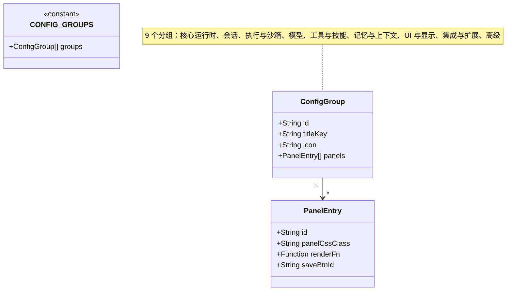
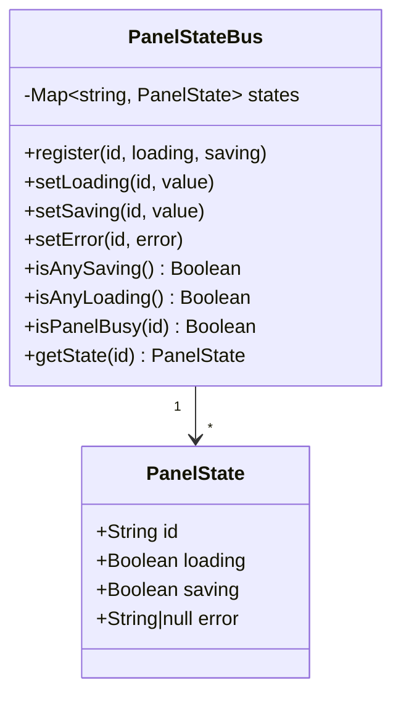
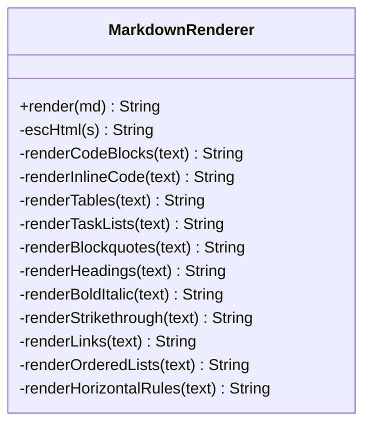
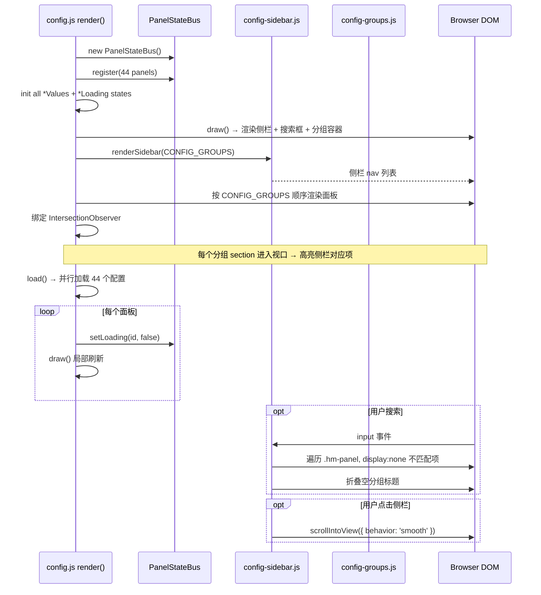
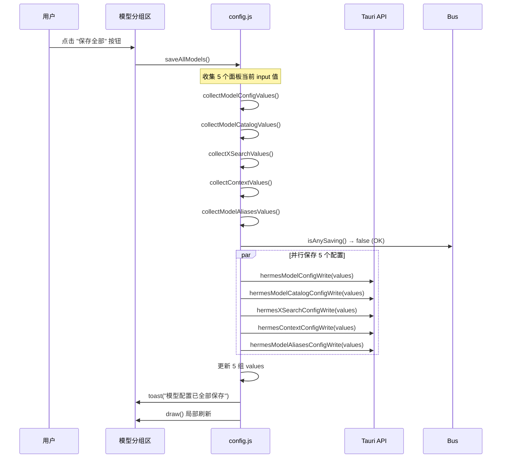
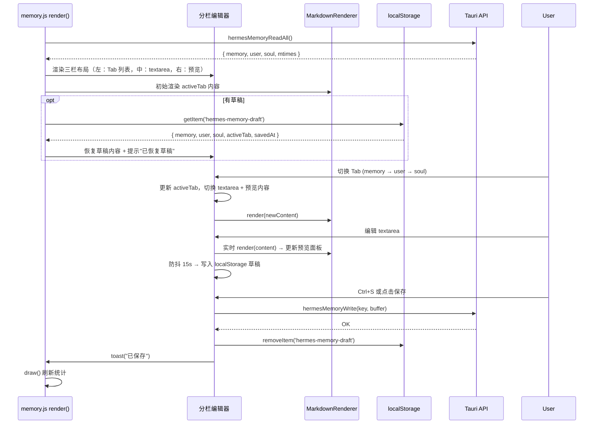
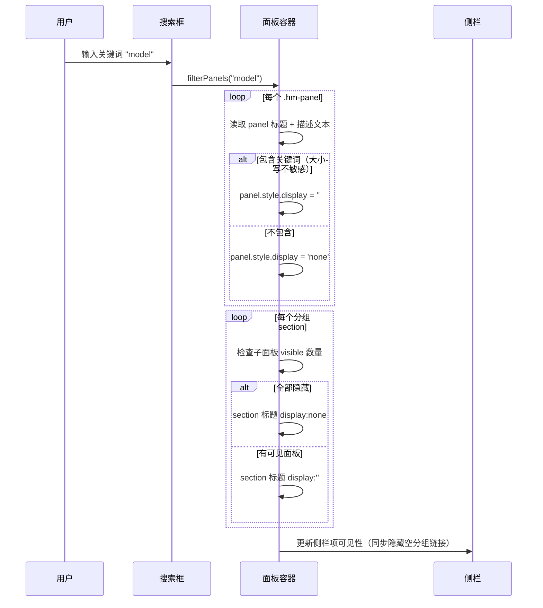
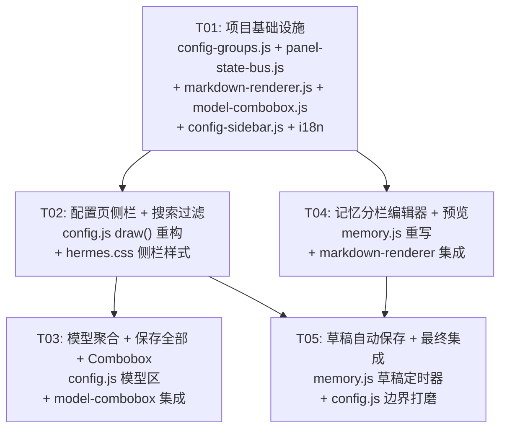

# Hermes 配置页 & 记忆管理 — 系统架构设计

> **作者**: Bob (Architect)  
> **日期**: 2025-06-04  
> **约束**: 原生 JS，无前端框架，不改后端 API，兼容亮/暗主题

---

## Part A: 系统设计

### 1. 实现方案与框架选型

#### 核心挑战

| 挑战 | 难度 | 策略 |
|------|------|------|
| config.js 5100+ 行，44 个面板平铺渲染 | 高 | 引入分组配置 schema 驱动渲染，不重写面板函数 |
| 每个面板 disabled 逻辑检查所有其他 saving 状态 | 高 | 将 saving/loading 状态集中到 `PanelStateBus`，用 `isAnySaving()` 替代手工枚举 |
| draw() 里 44 行 `${renderXxxPanel()}` 调用 | 中 | 改为循环遍历 `CONFIG_GROUPS`，动态调用 |
| mdToHtml() 极简，不支持表格/任务列表/删除线 | 中 | 重写为分层正则替换，不引入 marked/markdown-it |
| 搜索过滤需实时响应 | 低 | `input` 事件 + CSS `display:none` 过滤，无需 Virtual DOM |
| 滚动高亮需 IntersectionObserver | 低 | 原生 API，无 polyfill 需求 |

#### 框架选型：纯 JS + 模块化拆分

**不引入任何第三方依赖**。原因：
1. 项目本身是原生 JS 架构，引入 marked/markdown-it 会破坏零依赖原则
2. 所需 Markdown 增强（表格、任务列表、删除线、引用块、代码高亮）可用 ~150 行正则实现
3. 侧栏导航 + 搜索过滤用原生 DOM API 足矣
4. Combobox 模糊匹配用原生 `<input>` + `<datalist>` 或自定义下拉，~200 行

**架构模式**：保持现有"render 函数返回 HTML 字符串 → innerHTML → bind 事件"模式，**不引入 Virtual DOM 或组件框架**。

**核心策略**：
- **PanelStateBus**：集中管理所有面板的 `saving`/`loading` 状态，提供 `isAnyBusy()` / `isPanelBusy(panelId)` 查询
- **Group Schema**：JSON 配置 9 个分组，每个分组包含面板 ID 列表
- **Sidebar**：基于 Group Schema 生成导航链接，监听 scroll + IntersectionObserver 高亮当前分组
- **Search Filter**：实时过滤面板 DOM 元素，按标题和描述匹配

---

### 2. 文件列表

#### 新建文件

```
src/engines/hermes/lib/config-groups.js       # 分组配置 schema
src/engines/hermes/lib/markdown-renderer.js   # 增强 Markdown → HTML 渲染器
src/engines/hermes/lib/model-combobox.js      # 模型名 Combobox 组件
src/engines/hermes/lib/panel-state-bus.js     # 面板状态总线（集中 saving/loading）
src/engines/hermes/lib/config-sidebar.js      # 侧栏导航 + 搜索过滤渲染
```

#### 修改文件

```
src/engines/hermes/pages/config.js            # 接入侧栏、分组渲染、搜索、状态总线
src/engines/hermes/pages/memory.js            # 分栏编辑器、Tab 切换、增强预览、草稿
src/engines/hermes/style/hermes.css           # 新增侧栏/分栏/搜索/combobox 样式
src/locales/modules/settings.js               # 新增侧栏分组标题、搜索占位符等 i18n
src/locales/modules/memory.js                 # 新增预览/草稿相关 i18n
```

---

### 3. 数据结构与接口

#### 3.1 分组配置 Schema (`config-groups.js`)



**分组定义（9 组）**：

```js
// src/engines/hermes/lib/config-groups.js
export const CONFIG_GROUPS = [
  {
    id: 'core-runtime',
    titleKey: 'engine.configGroupCoreRuntime',
    icon: '<svg>...</svg>',
    panels: [
      { id: 'runtime', cssClass: 'hm-config-runtime-panel' },
      { id: 'agent-runtime', cssClass: 'hm-config-agent-runtime-panel' },
      { id: 'unauthorized-dm', cssClass: 'hm-config-unauthorized-dm-panel' },
    ],
  },
  {
    id: 'sessions',
    titleKey: 'engine.configGroupSessions',
    icon: '<svg>...</svg>',
    panels: [
      { id: 'sessions-maintenance', cssClass: 'hm-config-sessions-maintenance-panel' },
      { id: 'updates', cssClass: 'hm-config-updates-panel' },
    ],
  },
  {
    id: 'execution',
    titleKey: 'engine.configGroupExecution',
    icon: '<svg>...</svg>',
    panels: [
      { id: 'execution-limits', cssClass: 'hm-config-execution-limits-panel' },
      { id: 'io-safety', cssClass: 'hm-config-io-safety-panel' },
      { id: 'streaming', cssClass: 'hm-config-streaming-panel' },
      { id: 'terminal', cssClass: 'hm-config-terminal-panel' },
      { id: 'checkpoints', cssClass: 'hm-config-checkpoints-panel' },
    ],
  },
  {
    id: 'models',
    titleKey: 'engine.configGroupModels',
    icon: '<svg>...</svg>',
    panels: [
      { id: 'model-config', cssClass: 'hm-config-model-panel' },
      { id: 'model-catalog', cssClass: 'hm-config-model-catalog-panel' },
      { id: 'x-search', cssClass: 'hm-config-x-search-panel' },
      { id: 'context-config', cssClass: 'hm-config-context-panel' },
      { id: 'model-aliases', cssClass: 'hm-config-model-aliases-panel' },
    ],
  },
  {
    id: 'tools-skills',
    titleKey: 'engine.configGroupToolsSkills',
    icon: '<svg>...</svg>',
    panels: [
      { id: 'skills-config', cssClass: 'hm-config-skills-config-panel' },
      { id: 'agent-toolsets', cssClass: 'hm-config-agent-toolsets-panel' },
      { id: 'platform-toolsets', cssClass: 'hm-config-platform-toolsets-panel' },
      { id: 'hooks', cssClass: 'hm-config-hooks-panel' },
      { id: 'curator-config', cssClass: 'hm-config-curator-config-panel' },
      { id: 'quick-commands', cssClass: 'hm-config-quick-commands-panel' },
    ],
  },
  {
    id: 'memory-context',
    titleKey: 'engine.configGroupMemoryContext',
    icon: '<svg>...</svg>',
    panels: [
      { id: 'memory', cssClass: 'hm-config-memory-panel' },
      { id: 'compression', cssClass: 'hm-config-compression-panel' },
      { id: 'prompt-caching', cssClass: 'hm-config-prompt-caching-panel' },
    ],
  },
  {
    id: 'ui-display',
    titleKey: 'engine.configGroupUiDisplay',
    icon: '<svg>...</svg>',
    panels: [
      { id: 'display', cssClass: 'hm-config-display-panel' },
      { id: 'human-delay', cssClass: 'hm-config-human-delay-panel' },
      { id: 'approvals', cssClass: 'hm-config-approvals-panel' },
    ],
  },
  {
    id: 'integrations',
    titleKey: 'engine.configGroupIntegrations',
    icon: '<svg>...</svg>',
    panels: [
      { id: 'browser', cssClass: 'hm-config-browser-panel' },
      { id: 'web-config', cssClass: 'hm-config-web-config-panel' },
      { id: 'lsp', cssClass: 'hm-config-lsp-panel' },
      { id: 'stt', cssClass: 'hm-config-stt-panel' },
      { id: 'tts-voice', cssClass: 'hm-config-tts-voice-panel' },
      { id: 'provider-routing', cssClass: 'hm-config-provider-routing-panel' },
      { id: 'openrouter-cache', cssClass: 'hm-config-openrouter-cache-panel' },
      { id: 'auxiliary', cssClass: 'hm-config-auxiliary-panel' },
    ],
  },
  {
    id: 'advanced',
    titleKey: 'engine.configGroupAdvanced',
    icon: '<svg>...</svg>',
    panels: [
      { id: 'security', cssClass: 'hm-config-security-panel' },
      { id: 'privacy', cssClass: 'hm-config-privacy-panel' },
      { id: 'kanban', cssClass: 'hm-config-kanban-panel' },
      { id: 'cron', cssClass: 'hm-config-cron-panel' },
      { id: 'logging', cssClass: 'hm-config-logging-panel' },
      { id: 'tool-guardrails', cssClass: 'hm-config-tool-guardrails-panel' },
      { id: 'mcp-servers', cssClass: 'hm-config-mcp-servers-panel' },
      { id: 'provider-overrides', cssClass: 'hm-config-provider-overrides-panel' },
    ],
  },
]
```

#### 3.2 PanelStateBus (`panel-state-bus.js`)



**核心 API**：

```js
// 初始化：在 render() 中注册所有面板
const bus = new PanelStateBus()
bus.register('model-config')   // 默认 loading=true, saving=false
bus.register('model-catalog')
// ... 44 个面板

// 替换 isBusy()：不再手动枚举 88 个变量
function isBusy() { return bus.isAnyLoading() || bus.isAnySaving() }

// 替换面板 disabled 逻辑
function renderModelConfigPanel() {
  const disabled = loading || saving || bus.isAnySaving()
  // ...
}
```

#### 3.3 记忆草稿存储 Schema (localStorage)

```json
// Key: "hermes-memory-draft"
{
  "memory": "# Raw markdown content for memory section",
  "user": "# Raw markdown content for user section",
  "soul": "# Raw markdown content for soul section",
  "activeTab": "memory",
  "savedAt": 1717500000
}
```

#### 3.4 Markdown 渲染器 (`markdown-renderer.js`)



处理顺序（**关键**：先代码块再行内，先块级再行内）：
1. `escHtml` → 转义 HTML 特殊字符
2. Fenced code blocks → `<pre><code class="lang-xxx">`
3. Tables → `<table>...</table>`
4. Blockquotes → `<blockquote>`
5. Task lists → `<li class="task-list-item"><input type="checkbox">`
6. Ordered lists
7. Unordered lists
8. Headings (h1-h6)
9. Horizontal rules
10. Inline code → `<code>`
11. Bold / Italic
12. Strikethrough → `<del>`
13. Links
14. Line breaks → `<br>`

---

### 4. 程序调用流程

#### 4.1 配置页渲染流程



#### 4.2 模型聚合区"保存全部"



#### 4.3 记忆管理分栏编辑流程



#### 4.4 搜索过滤流程



---

### 5. 待明确事项

| # | 事项 | 假设 | 影响 |
|---|------|------|------|
| 1 | model-catalog API 返回格式 | 假设返回 `{ models: [{ id, name, provider }] }` 或类似结构 | 若格式不同需调整 combobox 解析逻辑 |
| 2 | 配置页 yaml 编辑器是否保留 | 是，放在所有分组下方，不变 | 无影响 |
| 3 | 侧栏宽度 | 240px，桌面端固定；移动端折叠为汉堡菜单（P2 后续） | CSS 变量 `--hm-sidebar-width: 240px` |
| 4 | 搜索是否搜索面板描述文字 | 是，搜索面板标题 + 描述 footnote | 提高匹配率 |
| 5 | 记忆分栏编辑器的预览面板宽度 | 右栏 40%，最小 320px；左侧编辑器 60% | CSS flex 布局 |
| 6 | 草稿覆盖策略 | 若 localStorage 草稿比服务器数据新（savedAt > mtime），提示用户选择 | 防止覆盖他人修改 |
| 7 | 模型 combobox 的模型数据来源 | 从 `hermesModelCatalogRead()` 获取已缓存的模型列表 | 若 catalog 未启用，combobox 退化为普通 input |

---

## Part B: 任务分解

### 6. 依赖包列表

**无需新增任何第三方依赖。** 所有功能用原生 JS + CSS 实现。

```
- (无) 本项目保持零运行时依赖
```

---

### 7. 任务列表

| 任务 ID | 任务名称 | 源文件 | 依赖 | 优先级 |
|---------|---------|--------|------|--------|
| T01 | 项目基础设施 | 5 个新建 + 2 个修改 | — | P0 |
| T02 | 配置页侧栏分组导航 + 搜索过滤 | 修改 config.js + hermes.css + settings.js | T01 | P0 |
| T03 | 模型面板聚合 + 保存全部 + Combobox | 修改 config.js + model-combobox.js + hermes.css + settings.js | T02 | P0 |
| T04 | 记忆管理分栏编辑器 + 增强预览 + Tab 切换 | 修改 memory.js + markdown-renderer.js + hermes.css + memory.js(locale) | T01 | P0 |
| T05 | 草稿自动保存 + 最终集成 + 边界打磨 | 修改 memory.js + config.js + hermes.css | T02, T04 | P1 |

---

#### T01 · 项目基础设施（新建核心模块）

**源文件**：
- `src/engines/hermes/lib/config-groups.js` (新建) — 9 组分组定义
- `src/engines/hermes/lib/panel-state-bus.js` (新建) — 状态总线
- `src/engines/hermes/lib/markdown-renderer.js` (新建) — 增强 MD 渲染器
- `src/engines/hermes/lib/model-combobox.js` (新建) — Combobox 组件
- `src/engines/hermes/lib/config-sidebar.js` (新建) — 侧栏 + 搜索渲染
- `src/locales/modules/settings.js` (修改) — 新增 9 个分组标题 + 搜索占位符等 i18n key
- `src/locales/modules/memory.js` (修改) — 新增预览/草稿/分栏相关 i18n key

**依赖**：无

**优先级**：P0

**内容**：
1. `config-groups.js`：定义 `CONFIG_GROUPS` 数组（9 组，44 面板映射），导出 `getGroupByPanelId()` / `getAllPanelIds()` 辅助函数
2. `panel-state-bus.js`：实现 `PanelStateBus` 类，`register()` / `setLoading()` / `setSaving()` / `isAnySaving()` / `isAnyLoading()` API
3. `markdown-renderer.js`：实现分层正则替换，支持表格、任务列表、删除线、引用块、有序列表、代码高亮（`<pre><code class="lang-xxx">`）、水平线；导出 `renderMarkdown(md)` 函数
4. `model-combobox.js`：实现 `createModelCombobox(container, options)` — 自定义下拉 combobox，支持键盘导航、模糊匹配、高亮匹配文本；导出工厂函数
5. `config-sidebar.js`：实现 `renderSidebar(groups)` + `initSidebarScrollSpy(groups)` + `initSearchFilter(container)` 三个函数
6. i18n：`settings.js` 新增 `configGroupCoreRuntime`、`configGroupSessions`、`configGroupExecution`、`configGroupModels`、`configGroupToolsSkills`、`configGroupMemoryContext`、`configGroupUiDisplay`、`configGroupIntegrations`、`configGroupAdvanced`、`configSearchPlaceholder`、`configSaveAllModels`、`configNoResults` 等 key
7. i18n：`memory.js` 新增 `preview`、`draftRecovered`、`draftSaved`、`tabMemory`、`tabUser`、`tabSoul` 等 key

---

#### T02 · 配置页侧栏分组导航 + 搜索过滤

**源文件**：
- `src/engines/hermes/pages/config.js` (修改) — 重构 `draw()` / `render()` 接入侧栏和分组
- `src/engines/hermes/style/hermes.css` (修改) — 侧栏样式 + 搜索框样式 + 分组标题样式 + 响应式
- `src/engines/hermes/lib/config-sidebar.js` (可能微调)

**依赖**：T01

**优先级**：P0

**内容**：
1. 修改 `render()`：用 `PanelStateBus` 替代手动声明的 44 组 loading/saving/error 变量（保留 values 变量不变）
2. 重构 `draw()`：顶部渲染 hero + 搜索框，下方渲染侧栏 + 主内容区的两栏布局
3. 主内容区按 `CONFIG_GROUPS` 遍历，每组输出 `<section id="cfg-group-{id}">` 包裹标题 + 面板列表
4. 侧栏 sticky 定位（`position: sticky; top: var(--header-height) + 16px`），渲染 9 个分组链接
5. 绑定 `IntersectionObserver`：监听每个 `<section>` 进入视口 → 更新侧栏 `.active` 状态
6. 搜索框绑定 `input` 事件：遍历 `.hm-panel`，`display:none` 不匹配项，隐藏空分组
7. CSS：侧栏 `width: 240px`，主内容区 `flex: 1`，分组标题 serif 风格，搜索框 `position: sticky` 在内容区顶部
8. **保持**：每个面板的独立 save 按钮 + disabled 逻辑用 `bus.isAnySaving()` 简化
9. **保持**：config.yaml 编辑器在所有分组下方不变

---

#### T03 · 模型面板聚合 + 保存全部 + Combobox

**源文件**：
- `src/engines/hermes/pages/config.js` (修改) — 模型聚合区渲染 + 保存全部逻辑 + combobox 集成
- `src/engines/hermes/lib/model-combobox.js` (可能微调)
- `src/engines/hermes/style/hermes.css` (修改) — 聚合区容器样式 + combobox 下拉样式
- `src/locales/modules/settings.js` (修改) — 新增 "保存全部" 按钮文字

**依赖**：T02（需要侧栏和分组渲染已就位）

**优先级**：P0

**内容**：
1. 在"模型"分组的 section 内，5 个模型面板连续渲染（去除各自独立的保存按钮）
2. 在分组标题栏右侧添加一个 `hm-btn--cta` "保存全部模型配置" 按钮
3. 实现 `saveAllModels()`：收集 5 个面板表单值 → 并行调用 5 个 API → toast 汇总结果
4. 默认模型输入框（`#hm-model-default`）改为 combobox：
   - 页面加载时从 `hermesModelCatalogRead()` 获取模型列表
   - 若 catalog 未启用或加载失败，退化为普通 input
   - 模糊匹配：输入 "claude" → 下拉显示所有含 "claude" 的模型
   - 键盘导航：↑↓ 选择，Enter 确认，Escape 关闭
5. CSS：combobox 下拉面板绝对定位，z-index 高于面板内容，暗色主题适配

---

#### T04 · 记忆管理分栏编辑器 + 增强预览 + Tab 切换

**源文件**：
- `src/engines/hermes/pages/memory.js` (修改) — 核心重写：弹窗 → 分栏布局
- `src/engines/hermes/lib/markdown-renderer.js` (可能微调)
- `src/engines/hermes/style/hermes.css` (修改) — 分栏布局样式 + 编辑器样式 + 预览面板样式
- `src/locales/modules/memory.js` (修改) — 新增 Tab/预览相关 i18n key

**依赖**：T01（需要 markdown-renderer 已就位）

**优先级**：P0

**内容**：
1. 移除 `showContentModal` 弹窗编辑方式，改为内嵌分栏布局
2. 布局：左侧 Tab 列表（窄列，3 个 Tab）+ 中间 textarea 编辑器 + 右侧实时预览面板
3. Tab 切换：点击 Tab 切换编辑器内容和预览，保存草稿状态（不丢失未保存编辑）
4. 编辑器：`<textarea>` 全高，monospace 字体，`spellcheck="false"`
5. 预览面板：`renderMarkdown(content)` 实时更新，滚动同步（可选 P2）
6. 增强预览效果：表格带边框斑马纹、代码块语法高亮（用 `<span>` class 区分 token）、任务列表可点击（纯展示）、删除线正确渲染、引用块左边框样式
7. 保留 Ctrl+S 快捷键保存
8. CSS：三栏 flex 布局，编辑器/预览面板独立滚动，暗色主题代码块适配

---

#### T05 · 草稿自动保存 + 最终集成 + 边界打磨

**源文件**：
- `src/engines/hermes/pages/memory.js` (修改) — 草稿定时器 + 恢复提示
- `src/engines/hermes/pages/config.js` (修改) — 滚动高亮微调 + 搜索边界情况
- `src/engines/hermes/style/hermes.css` (修改) — 草稿提示样式 + 微调

**依赖**：T02, T04

**优先级**：P1

**内容**：
1. 记忆编辑器 15 秒防抖自动保存草稿到 localStorage
2. 页面加载时检测草稿：若 `savedAt > 服务器 mtime`，显示横幅"检测到未保存的草稿，已自动恢复" + "放弃草稿"按钮
3. 成功保存到服务器后自动清除草稿
4. 配置页搜索边界：空搜索恢复全部、特殊字符转义、无结果时显示"未找到匹配的配置项"
5. 侧栏滚动高亮：处理快速滚动防抖、页面底部最后一组高亮
6. 交叉浏览器测试：确认 Firefox/Chrome/Edge 的 IntersectionObserver 行为一致
7. 确认 model combobox 在 catalog 禁用时优雅降级
8. 确认所有 44 个面板的保存逻辑在 `PanelStateBus` 下正常工作

---

### 8. 共享知识（跨文件约定）

```
## DOM ID 命名规范
- 面板保存按钮：hm-{panel-slug}-save（如 hm-model-config-save、hm-runtime-save）
- 面板容器 CSS class：hm-config-{panel-slug}-panel
- 分组 section ID：cfg-group-{group-id}
- 搜索输入框 ID：hm-config-search
- 侧栏导航容器 ID：hm-config-sidebar

## CSS 类名命名规范
- 侧栏相关：hm-sidebar / hm-sidebar__nav / hm-sidebar__link / hm-sidebar__link--active
- 搜索相关：hm-search / hm-search__input / hm-search__clear
- 分组标题：hm-group-heading / hm-group-heading__title / hm-group-heading__icon
- 模型聚合区：hm-model-cluster / hm-model-cluster__header / hm-model-cluster__body
- 分栏编辑器：hm-mem-split / hm-mem-split__tabs / hm-mem-split__editor / hm-mem-split__preview
- Combobox：hm-combo / hm-combo__input / hm-combo__dropdown / hm-combo__option

## CSS 变量约定
- 新增 CSS 变量统一放在 [data-engine="hermes"] 块内，使用 --hm- 前缀
- 侧栏宽度：--hm-sidebar-width: 240px
- 侧栏背景：--hm-sidebar-bg: var(--hm-surface-1)
- 搜索框高度：--hm-search-height: 44px

## 事件命名约定
- 自定义 DOM 事件命名：hermes:{module}:{action}
  例：hermes:memory:draft-saved, hermes:config:group-changed
- 使用 CustomEvent + detail 传参

## 状态总线约定
- 所有面板的 loading/saving 状态必须通过 PanelStateBus 管理
- 面板 disabled 逻辑统一使用 bus.isAnySaving() 而非枚举变量
- 面板自身保存中时，仅禁用自身保存按钮（bus.setSaving(selfId, true)）

## i18n Key 约定
- 配置分组标题：engine.configGroup{Name}（如 engine.configGroupModels）
- 配置页搜索：engine.configSearchPlaceholder
- 记忆 Tab：engine.memoryTab{Name}（如 engine.memoryTabMemory）
- 草稿相关：engine.memoryDraft{Action}（如 engine.memoryDraftRecovered）

## localStorage Key 约定
- 记忆草稿：hermes-memory-draft
- 搜索历史（可选 P2）：hermes-config-search-history

## API 响应格式
- 所有 API 响应使用 { status: 'ok'|'error', data?: ..., message?: ... } 格式
- 后端 API 契约不变，新增功能不调用新 API（model catalog 使用已有 hermesModelCatalogRead）
```

---

### 9. 任务依赖图



---

## 附录：关键设计决策说明

### A. 为什么不重写面板函数？

44 个 `renderXxxPanel()` 函数每个都有独立的：
- 表单 HTML 模板（字段数量、类型、布局各不相同）
- 默认值常量
- load/save 函数（调用不同 API endpoint）
- disabled 逻辑（手工枚举其他 saving 变量）

重写这些函数风险极高且无收益。策略是：
1. 用 `PanelStateBus` 简化 disabled 逻辑（不改面板内部结构）
2. 用 `CONFIG_GROUPS` 改变渲染顺序（不改面板函数本身）
3. 模型聚合区仅在"模型"分组下添加一个"保存全部"按钮 + 移除 5 个独立保存按钮

### B. 为什么不引入 marked/markdown-it？

- marked 压缩后 ~40KB，markdown-it ~80KB
- 当前项目零运行时依赖，引入包管理会增加构建复杂度
- 所需 Markdown 功能有限（表格、任务列表、删除线、引用块、有序列表、代码高亮），~150 行正则即可覆盖
- 性能：正则替换 O(n)，对于 Agent 记忆文件（通常 < 50KB）完全够用

### C. IntersectionObserver 兼容性

IntersectionObserver 在所有现代浏览器中可用（Chrome 51+, Firefox 55+, Edge 15+, Safari 12.1+）。项目目标平台为桌面端 Tauri/Electron，无需 polyfill。
